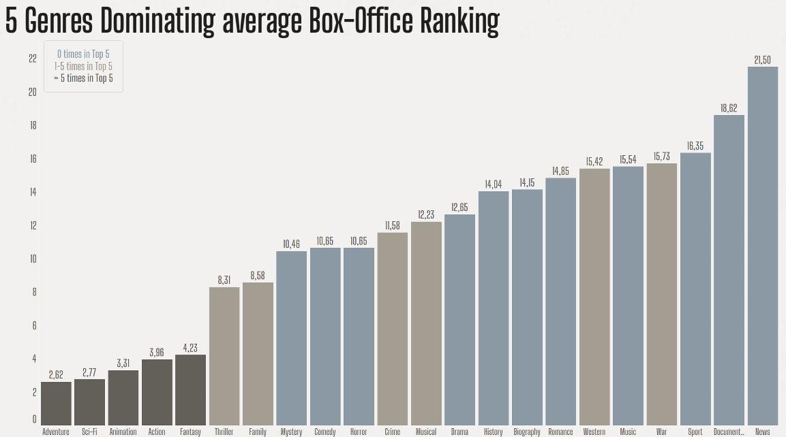

# INTRODUCTION
**Date: October / November 2024**

This project was crafted as the capstone of a "Data Analytics Bootcamp" by a team of three data enthusiasts, diving into the vast world of film data to tackle a challenging, real-world question: What makes a movie a hit?
Armed with a robust dataset from IMDb—the world's largest movie database—we took on the task of sifting through a massive amount of film information. But we didn’t stop there! To deepen our analysis, we harnessed additional data from The Numbers, Box Office Mojo, and the European Audiovisual Observatory, gathered through web scraping techniques.
The project centered around a fictional but insightful scenario: uncovering key insights about the current worldwide movie market and pinpointing the critical factors that drive a film’s success. In the end, our findings were showcased in a lively presentation, bringing our audience along on a data-driven journey through Hollywood and other markets hits, box office trends, and the secrets of cinematic success.

[Click here](https://youtu.be/wkeVFN3-ecQ) to see the video of our final presentation of this 4 week project.

---

# DATA INFORMATION
### Data Sources
Source | Link | Data
-------- | -------- | --------
IMDB | https://datasets.imdbws.com/ | Information about every movie in the IMDB database, divided into 7 datasets (Cointaining title, release year, runtime, ratings, genre, actors, directors, writers)
Box Office Mojo | https://www.boxofficemojo.com/ | Box Office Revenue data for every movie (webscraped)
The Numbers | https://www.the-numbers.com/ | Top 200 movies per year for NA countries
European Audiovisual Observatory | https://www.obs.coe.int/en/web/observatoire | Top 200 movies per year for EU countries

---

# Workflow - What each notebook contains

## 1. Basic preparations

[1.0_first-preparations.ipynb](1.0_first-preparations.ipynb)
- explore the first three data sources: IMDB-data, NA-ticket-sales, and EU-ticket-sales
- excluded unneeded columns
- transform columns into neccessary form
- merge tables from IMDB into one big table with each row describing one unique movie

## 2. Merging the initial three data tables

Next, we need to combine our information on number of tickets sold from The Numbers the European Audiovisual Observatory with information on each movie from IMDB. 
The only overlapping columns to merge with are _Movie Title_ and _Release Year_. Since both do not match perfectly between the three sources 
(some movies had were documented with other names or using other symbols), we write a function performing lots of string formations. 

[2.0_table-merge_additional-data.ipynb](2.0_table-merge_additional-data.ipynb)
- we create a new seperate table containing additional titles for each movie
- goal is to have more title to compare with when merging thereby increase the number of successfully merged rows

[2.1_table-merge_part1.ipynb](2.1_table-merge_part1.ipynb)
- finally, after applying the function, we are left with roughly 300 movies that can not find there match in the IMDB dataset
- in part 1, we apply our merge and correct the first 100 movie titles and release years by hand

[2.2_table-merge_part2.ipynb](2.2_table-merge_part2.ipynb)
- in part 2, we correct another 100 by hand
- there are different notebooks for each chunk of 100 rows because we split the three collaborators of this project

[2.3_table-merge_final-nb.ipynb](2.3_table-merge_final-nb.ipynb)
- in part 3, we correct the last 100 movies by hand
- we upload our chunks to a postgreSQL database and combine the tables back to their original size
- finally, we merge on _Movie Title_ and _Release Year_, check that all movies found their match and upload our final table

## 3. Webscraping and preparing Box Office revenue data

[3.0_box-office-revenue_preparation.ipynb](3.0_box-office-revenue_preparation.ipynb)
- we import our raw, scraped Box Office Mojo data and adjust data types
- next, we correct box-office-revenues for inflation

[3.1_box-office-revenue_further-corrections.ipynb](3.1_box-office-revenue_further-corrections.ipynb)
- finally, we correct our data making sure to have correct values for worldwide box-office-revenue

[3.2_box-office-revenue_further-inflation-correction-categories.ipynb](3.2_box-office-revenue_further-inflation-correction-categories.ipynb)
- additional information on the categories for which we can correct for inflation
- in our example we use category: _SS62031,"Admission to movies, theaters, and concerts"_

## 4. Changing from wide to long data format

[4.0_transposing_part1.ipynb](4.0_transposing_part1.ipynb)
- we change back columns with multiple entries and information that is spread over several columns to long format (more helpful when working in Tableau)
- aferwards, each information is saved as an individual table together with a unique identifier for easy merging/connecting
- tables we create in this notebook: actors, genres, directors, writers

[4.0_transposing_part2.ipynb](4.0_transposing_part2.ipynb)
- tables we create in this notebook: producing country

[4.0_transposing_part3.ipynb](4.0_transposing_part3.ipynb)
- tables we create in this notebook: country released in (from the table on box-office-revenue)

## 5. Additional Tables in SQL

[5.0_tranforming-genres.sql](5.0_tranforming-genres.sql)
- we created an additional table showing the avg box-office and rank for each genre over each year in SQL

## DATA VISUALISATION
Examples of visualizations that you can also see in our final presentation (link in Introduction)

